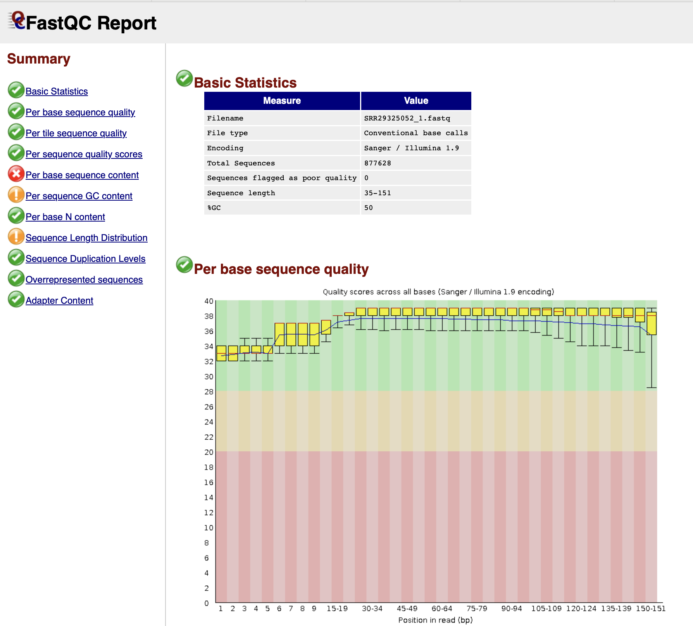
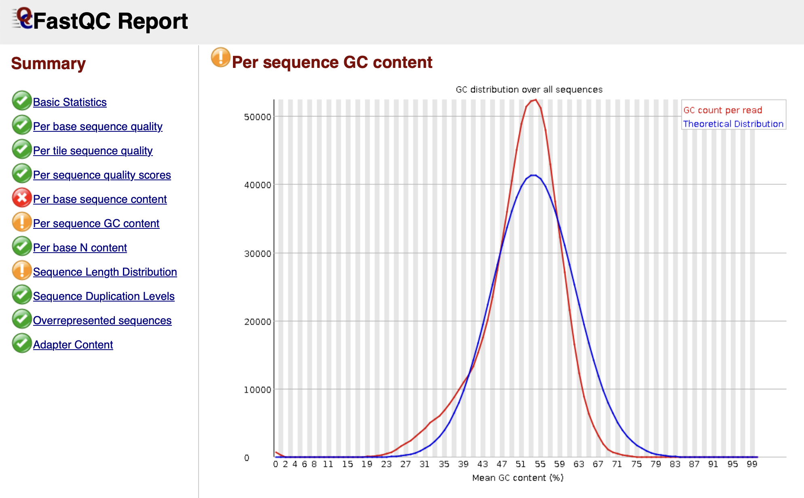

# Actividad 2 Grupal                                                                                                                        
# Herramientas Bioinformáticas para Analizar la Expresión Genetica de la Bacteria Escherichia coli


**Objetivos**
Este proyecto tiene como objetivo el desarrollo de un pipeline bioinformático para analizar secuencias de ADN y ARN de forma automatica. Ofrece una configuracion basica de una maquina linux con lo esencial para ejecutar diferentes herramientas en linea de comandos como Toolkit, FastQC, Trimmomatic y Cufflinks. 

## Estructura del Proyecto bioinformatico
1. **Configuración Docker**
 - `Docker Image/` : Docker es uma herramienta de codigo abierto para la automatización de despliegue de aplicaciones, con la condiguracion esencial de un sistema operativo. Su versatilidad radica en la facilidad de recuperarse a fallo y ser empleado para ambientes productivos o de prueba. 
     - `Dockerfile` : Contiene las instrucciones para la configuración inicial del sistema operativo y software necesario.
     - `docker-compose.yml` : Permite configurar diferentes contenedores y comportarse como una sola aplicación. 

2. **Pipeline - Script automatizado**
 - `Pipeline/` : Directorio que contiene los papilines por bacteria. 
     - `escherichia-coli.sh` : Contiene las instrucciones para analizar secuencias de ADN y RNA, a continuación una descripcion de las acciones realizadas:

      - Usar la herramienta prefetch del SRA Toolkit para descargar los datos.
      - Convertir el archivo SRA descargado a formato FASTQ.
      - Ejecutar FastQC para evaluar la calidad de las lecturas de RNA-Seq.
      - Recortar las lecturas usando Trimmomatic para eliminar adaptadores y bases de baja calidad.
      - Construir un índice a partir del archivo de secuencia del genoma de referencia Escherichia coli".
      - Alinear las lecturas recortadas al genoma de referencia usando HISAT2.
      - Convertir el archivo SAM a un archivo BAM ordenado.
      - Usar StringTie o Cufflinks para ensamblar y cuantificar transcritos.
      - Cuantificar genes y estimar la abundancia de transcritos.

3. **Gen de Referencia**
 - `Gen de Referencia/` : Contiene los genomas de referencia. 
     - `ncbi_dataset-escherichia coli/` : Archivo descargado de NCBI Dataset con la informacion del genoma de Referencia: https://www.ncbi.nlm.nih.gov/datasets/taxonomy/562/.

 4. **Preparación de los datos**
 - `Laboratorio de Prueba/` : Directorio de trabajo con todos los resultados obtenidos. 
     - `GCA_000005845.2_ASM584v2_genomic.fna` : Corresponde al genoma de referencia de NCBI Dataset.   
     - `SRR29325052/` : Corresponde al Sample: Escherichia coli, descargado de https://www.ncbi.nlm.nih.gov/sra/SRX24841510[accn]

 4. **Archivo soportados**
    Archivos usados en bioinformatica que brindan información de los resultados obtenidos a partir de alineamientos de secuencias de ARN-seq.

   - `.fna` : (FASTA Nucleotide)Contiene la secuencia denómica en formato FASTA del genoma de referencia.   
   - `.sra` : (Sequence Read Archive) Archivo binario que contiene datos en crudo de secuencias, son generados por (Illumina o PacBio) y capaces de almacenar grandes volumenes de datos.   
   - `.fq` : Contiene secuencias de lectura en formato FASTQ.   
   - `.gtf` : Contiene anotaciones de genes y transcritos.   
   - `ctab` : Contiene informción de cuantificacion de transcritos.   
   - `.ht2` : Contiene los indices de HISAT2 para alineación.   
   - `.sam` : Contiene las lecturas alineadas en formato SAM.   
   - `.bam` : Contiene las lecturas alineadas en formato BAM.   
   - `.html` : Contiene el resultado de analisis de calidad de FastQC.   
   

5. **Instrucciones de uso**
   **Construcción del ambiente**
 
    - `Clonar el repositorio` : git clone https://github.com/claudia-giraldo0398/actividad-2-grupal.git
    - `Ingresar a la carpeta` : cd actividad-2-grupal/Docker Image
    - `Construir el ambiente` : docker build --platform linux/amd64 -t bioinformatic-v1-bioinformatics_lab .
    - `Iniciar el amviente`   : docker-compose up -d
    - `Iniciar el ambiente`   : docker-compose down

```bash
    # Clon el repositorio
    git clone https://github.com/claudia-giraldo0398/actividad-2-grupal.git

    # Cambia al directorio actividad-2-grupal
    cd actividad-2-grupal

    # Crea el directorio de trabajo "laboratorio"
    mkdir laboratorio

    # Ingresa al directorio "laboratorio"
    cd laboratorio

    # Copia el archivo "escherichia-coli.sh" desde "laboratorio/Pipeline" a la carpeta actual
    cp ../Pipeline/escherichia-coli.sh .

    # Permisos de ejecución al archivo "escherichia-coli.sh"
    chmod +x escherichia-coli.sh

    # Copia el archivo de referencia GCA_000005845.2_ASM584v2_genomic.fna a esta carpeta
    cp "../Gen de Referencia/ncbi_dataset-escherichia coli/GCA_000005845.2/GCA_000005845.2_ASM584v2_genomic.fna" .

    # Ejecutar el archivo "escherichia-coli.sh"
    ./escherichia-coli.sh

```


6. **Visualización de resultados:**
- SRR29325052_1_fastqc.html


- SRR29325052_2_fastqc.html



## Información Adicional
Este proyecto está en fase de desarrollo inicial.


## Contribuciones
¡Las contribuciones son bienvenidas! Si desea contribuir a este proyecto, envíe una solicitud en [GitHub](https://github.com/tu-usuario/proyecto-bioinformatica).


## Licencia
Este proyecto está licenciado bajo la Licencia Pública General GNU - ver el archivo [LICENSE] para más información.
